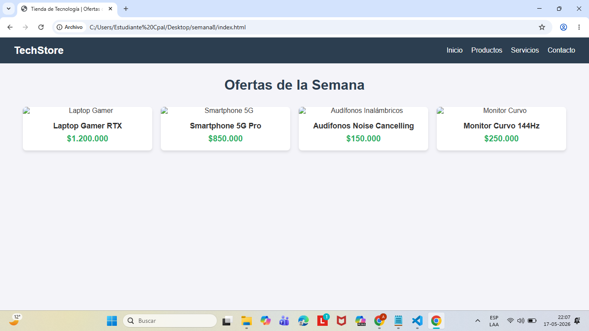
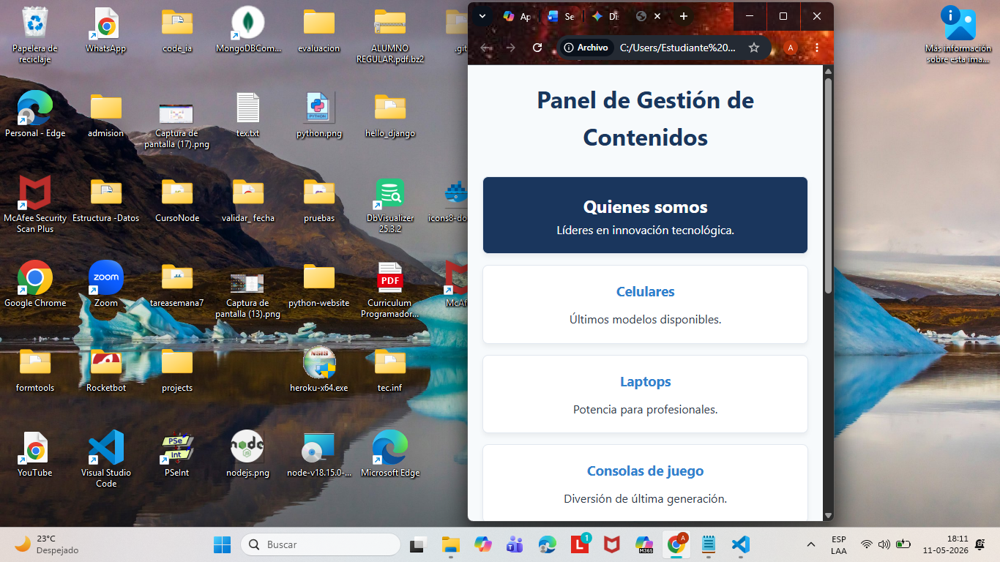

# 💻 Tienda de Tecnología - Diseño Web Adaptable


Este repositorio contiene el desarrollo del proyecto de maquetación responsiva correspondiente a la asignatura de **Programación Web 1** (Semana 8). El objetivo principal del proyecto es estructurar una interfaz web que se adapte fluidamente a diferentes dispositivos móviles y de escritorio.

## 🎯 Descripción del Proyecto

El caso práctico simula los requerimientos de los propietarios de una tienda de tecnología que necesitan mejorar la experiencia de usuario (UX) en la promoción de sus productos. La solución implementada utiliza un enfoque de diseño adaptable sin depender de frameworks externos, basándose enteramente en estándares web modernos.

## 🛠️ Tecnologías y Metodologías Utilizadas

*   **HTML5 Semántico:** Para una correcta estructuración del contenido (`<header>`, `<nav>`, `<main>`, `<section>`, `<article>`).
*   **CSS3 (Flexbox):** Uso extensivo del modelo de caja flexible unidimensional para el control de la alineación, distribución del espacio y reordenamiento del layout.
*   **Media Queries:** Implementación de puntos de quiebre (breakpoints) estratégicos a los `768px` para optimizar la visualización en tablets y smartphones.
*   **Metodología BEM (Block, Element, Modifier):** Nomenclatura estandarizada en las clases CSS para asegurar un código escalable, modular y fácil de mantener.

## ⚙️ Características Principales

### Vista Previa del Proyecto

**Resolución de Escritorio:**


**Resolución Móvil:**


1.  **Navegación Flexible:** El menú principal (`display: flex`) distribuye los enlaces de forma horizontal en resoluciones de escritorio y cambia su eje (`flex-direction: column`) para apilarse de forma táctil en dispositivos móviles.
2.  **Galería de Ofertas Fluida:** Implementación de tarjetas de productos que ajustan su ancho base de manera dinámica mediante la propiedad `flex: 1 1 250px` y `flex-wrap`, permitiendo múltiples columnas en escritorio y una sola columna en pantallas reducidas.

## 🚀 Cómo ejecutar el proyecto

Este es un proyecto estático, por lo que no requiere la instalación de dependencias ni de un servidor local complejo.

1.  Clona este repositorio en tu equipo local:
```bash
    git clone [https://github.com/Sergio25-prog/semana8.git](https://github.com/Sergio25-prog/semana8.git.)
    ```
2.  Navega hasta la carpeta del proyecto.
3.  Abre el archivo `index.html` directamente en cualquier navegador web moderno (Google Chrome, Mozilla Firefox, Edge).

## 🧑‍💻 Autor

*   **[Sergio Delgado/Backend Specialist]** - *Developer*
*   Instituto Profesional IACC - Ingeniería / Tecnologías de la Información.